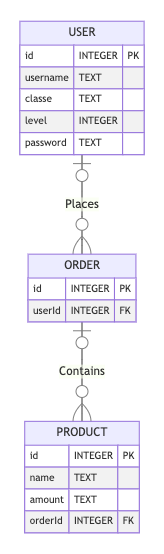

# Boas vindas ao repositório do projeto Trybesmith!


  <summary><strong>👨‍💻 O que foi desenvolvido</strong></summary><br />

  Para este projeto, uma loja de itens medievais foi criada, no formato de uma _API_, utilizando _Typescript_.
  
  Foi desenvolvido todas as camadas da aplicação (_Models_, _Service_ e _Controllers_), por meio dessa aplicação, será possível realizar as operações básicas que se pode fazer em um determinado banco de dados:
  Criação, Leitura, Atualização e Exclusão (ou `CRUD`, para as pessoas mais íntimas 😜 - _Create, Read, Update_ e _Delete_).

  É possível utilizar alguns _endpoints_ que irão ler e escrever em um banco de dados, utilizando o **MySQL**.

  ---


  ⚠️ **Importante** ⚠️:

  - Para executar o projeto localmente você precisa ter o node v16 ou superior instalado.

  ---
  ## 🎲 Diagrama Entidade Relacionamento do projeto

  O banco de dados do projeto segue a estrutura abaixo:

  

  ---
  ## Antes de executar o projeto

  1. Clone o repositório

  - `git clone git@github.com:ThiagoW21/project-trybesmith.git`.
  - Entre na pasta do repositório que você acabou de clonar:
    - `cd project-trybesmith`

  2. Instale as dependências [**Caso existam**]

  - `npm install`
 


  ## 🪑 Tabelas

  O banco tem tabelas: pessoas usuárias, produtos e pedidos.

  ```sql
  DROP SCHEMA IF EXISTS Trybesmith;
  CREATE SCHEMA Trybesmith;

  CREATE TABLE Trybesmith.Users (
    id INTEGER AUTO_INCREMENT PRIMARY KEY NOT NULL,
    username TEXT NOT NULL,
    classe TEXT NOT NULL,
    level INTEGER NOT NULL,
    password TEXT NOT NULL
  );

  CREATE TABLE Trybesmith.Orders (
    id INTEGER AUTO_INCREMENT PRIMARY KEY NOT NULL,
    userId INTEGER,
    FOREIGN KEY (userId) REFERENCES Trybesmith.Users (id)
  );

  CREATE TABLE Trybesmith.Products (
    id INTEGER AUTO_INCREMENT PRIMARY KEY NOT NULL,
    name TEXT NOT NULL,
    amount TEXT NOT NULL,
    orderId INTEGER,
    FOREIGN KEY (orderId) REFERENCES Trybesmith.Orders (id)
  );
  ```

